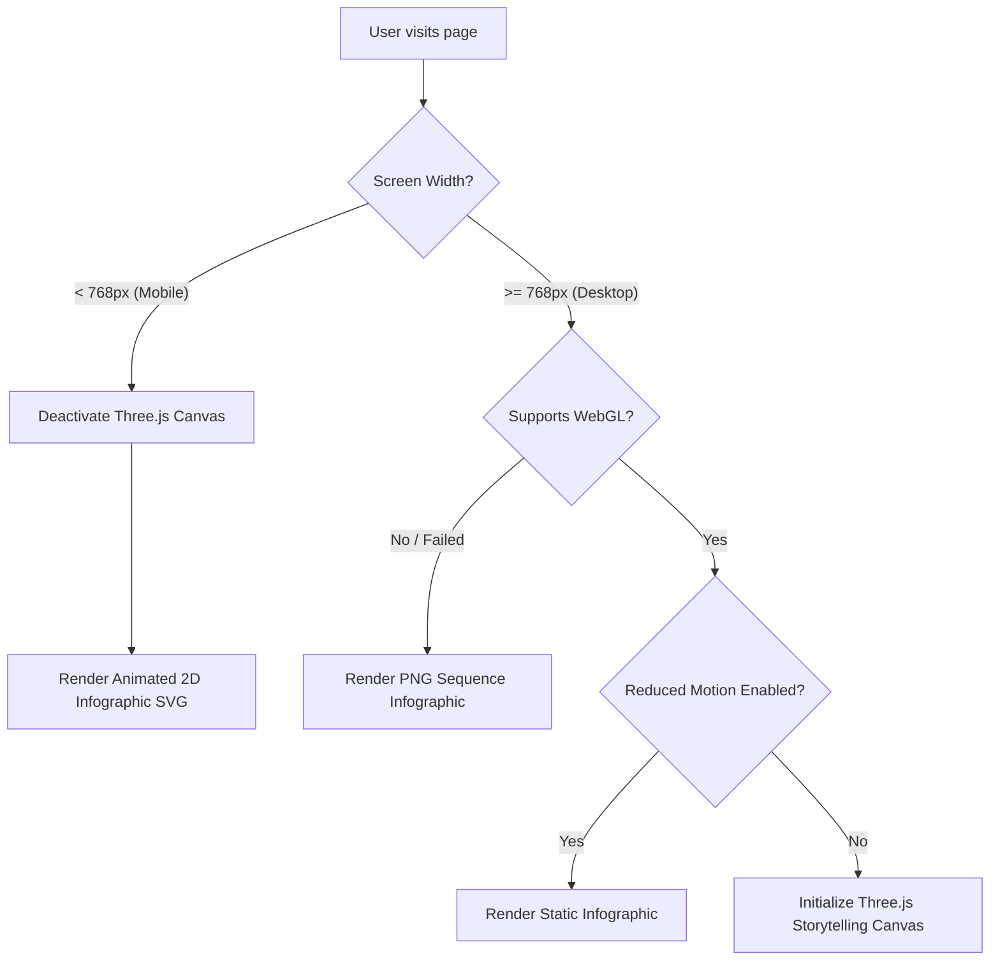

# Stage 2: UX Architecture & Interactive Storytelling Map

This document establishes the user experience (UX) layout, sitemap pathways, and the scroll-driven storytelling architecture for the Omani Beverage Logistics website.

---

## 1. Page-by-Page UX Architecture Specifications

### Homepage
| Element | Specification |
| :--- | :--- |
| **User Goals** | Assess reliability and scale instantly, check national coverage, understand tech capabilities. |
| **Business Goals** | Capture enterprise RFQs, highlight high-status clients (Coca-Cola), project authority. |
| **Section Hierarchy** | 1. Hero Fold<br>2. Trust & Metrics Dashboard<br>3. "The Journey of Refreshment" Storytelling Island<br>4. Core Services Highlights<br>5. Live Operations telematics preview<br>6. Enterprise client showcase<br>7. RFQ Intake Form |
| **Conversion Focus** | Floating "Request Enterprise Quote" button, sticky Header RFQ action. |
| **Animations** | KPI numbers incrementing dynamically, slide-in reveal on scroll, route drawing on map. |

### About Us Page
| Element | Specification |
| :--- | :--- |
| **User Goals** | Verify regulatory compliance, check company history and leadership, assess financial security. |
| **Business Goals** | Leverage certifications to address legal and procurement criteria, establish company history. |
| **Section Hierarchy** | 1. Editorial Header (Mission)<br>2. History Timeline (interactive)<br>3. Leadership Profile Grid<br>4. Safety & Compliance Vault (Certificates download)<br>5. Partner Network Map |
| **Conversion Focus** | Downloadable PDF containing compliance sheets (ISO, HACCP). |
| **Animations** | Timeline slider scroll-reveal, team cards hover lift effects. |

### Services Page
| Element | Specification |
| :--- | :--- |
| **User Goals** | Determine if specific cold chain temperatures are supported, review warehousing capacity. |
| **Business Goals** | Cross-sell logistics and warehousing integration, showcase custom cross-docking capabilities. |
| **Section Hierarchy** | 1. Detailed Services Header<br>2. Multi-Temperature Cold Chain details<br>3. Warehouse Automation showcases (4:3 image)<br>4. FMCG Supply Chain solutions<br>5. Dynamic FAQ Grid |
| **Conversion Focus** | "Speak with a Cold Chain Specialist" targeted contact link. |
| **Animations** | Flip-cards displaying technical specs (chilled, frozen, ambient temperature thresholds). |

### Fleet Page
| Element | Specification |
| :--- | :--- |
| **User Goals** | View technical vehicle capacities, check safety standards, confirm availability of backup trucks. |
| **Business Goals** | Position fleet as state-of-the-art, secure, and modern. |
| **Section Hierarchy** | 1. Fleet Overview Header<br>2. Fleet Grid (Heavy-duty, Light-duty, Refrigerated vans with 1:1 image)<br>3. Telematics & Safety systems specs<br>4. Eco-friendly/Green logistics statement |
| **Conversion Focus** | "Download Fleet Technical Sheets" PDF action. |
| **Animations** | Vehicle carousel slider, interactive vehicle blueprints with hotspots. |

### Technology Page
| Element | Specification |
| :--- | :--- |
| **User Goals** | Evaluate tracking portals, confirm API integrations, check route optimization dashboard. |
| **Business Goals** | Demonstrate tech leadership to defeat traditional low-tech competitors. |
| **Section Hierarchy** | 1. Technology Header (Control Center image)<br>2. Telemetry and WMS software features<br>3. Route Optimization visualization<br>4. Real-time temperature control logs example |
| **Conversion Focus** | "Request Client Portal Demo" button. |
| **Animations** | Interactive route optimization wireframe drawing path, mock UI telemetry metrics ticking. |

### Coverage Page
| Element | Specification |
| :--- | :--- |
| **User Goals** | Verify transit times to regional hubs (Salalah, Sohar), review hub locations. |
| **Business Goals** | Establish absolute nationwide reach and cross-border GCC capability. |
| **Section Hierarchy** | 1. Geographic Coverage Header<br>2. Interactive Oman Map (governorate filter)<br>3. Hub Matrix Table (Muscat, Sohar, Salalah, Nizwa, Duqm, Sur)<br>4. GCC cross-border timelines |
| **Conversion Focus** | "Check Delivery Times" interactive search query. |
| **Animations** | SVG map path tracing, pulse indicators on active hubs, hub coordinate detail slide-overs. |

### Contact Page
| Element | Specification |
| :--- | :--- |
| **User Goals** | Find direct phone numbers, get directions to warehouses, submit enterprise RFQs. |
| **Business Goals** | Qualify and route incoming sales leads to proper departments. |
| **Section Hierarchy** | 1. Contact Info Cards (direct phone/email/address)<br>2. Multiplex Enterprise RFQ Form<br>3. Office & Hub Map pins |
| **Conversion Focus** | Completed RFQ Form (multi-step clean form). |
| **Animations** | Multi-step form step-transitions, focus indicator shifts. |

---

## 2. Homepage Section Layout: 2D vs. WebGL vs. Three.js

To guarantee peak web performance and prevent main thread freezing, the homepage layout isolates heavy 3D canvases.

```text
+-------------------------------------------------------------------------------+
| Section 1: Hero Fold (2D)                                                     |
| - HTML / CSS Layout, optimized LCP image backdrop.                            |
+-------------------------------------------------------------------------------+
| Section 2: Trust & Metrics Dashboard (2D)                                     |
| - CSS Grid, micro-animations (number ticking counters).                       |
+-------------------------------------------------------------------------------+
| Section 3: "The Journey of Refreshment" (THREE.JS STORYTELLING ISLAND)        |
| - Fixed viewport, scroll-locked canvas container.                             |
| - Renders 3D glass bottle and cold chain environment checkpoints.             |
+-------------------------------------------------------------------------------+
| Section 4: Core Services Panel (2D)                                           |
| - High-contrast cards, CSS slide-ins on scroll.                               |
+-------------------------------------------------------------------------------+
| Section 5: Telemetry Map Dashboard (WebGL ENHANCEMENTS)                        |
| - HTML canvas overlay running lightweight WebGL shader for map route glows.    |
+-------------------------------------------------------------------------------+
| Section 6: Client & Certifications Trust Grid (2D)                            |
| - Multi-logo layouts, simple opacity fade animations.                         |
+-------------------------------------------------------------------------------+
| Section 7: RFQ Form & Footer (2D)                                             |
| - Semantic HTML form, standard layout.                                         |
+-------------------------------------------------------------------------------+
```

---

## 3. "The Journey of Refreshment" Three.js Storytelling Island

### User Flow
1. **Entrance**: User scrolls down the page. As they enter Section 3, the page smooth-scrolls and locks into a sticky container.
2. **Interactive Scroll**: Scrolling no longer moves the page down; instead, it progresses a virtual timeline from 0% to 100%, driving the camera and 3D bottle animation.
3. **Exit**: Upon reaching 100%, the scroll lock releases, and the user continues scrolling down into the Services section.

### Scroll Checkpoints & Camera Progression

| Checkpoint | Progress | Target View | Camera Action | Visual Transitions |
| :--- | :--- | :--- | :--- | :--- |
| **0%** | Production Facility | Bottle Neck | Focused tight on the bottle neck, high aperture blur. | Golden backlight, water droplets appear. |
| **20%** | Cold Warehouse | Full Bottle | Camera pulls back, showing steel rack silhouettes. | Blue glowing light overlays, cooling vapor. |
| **40%** | Fleet Loading | Low Angle | Camera drops low, looking up at the trailer entry. | Orange indicator light flashes. |
| **60%** | Highway Transit | Panoramic | Camera orbits to bird-eye, tracking speed line grids. | Warm mountain shadows sweeping by. |
| **80%** | Retail Refrigerator| Close-up Shelf| Camera matches height of grocery shelf. | Clean white interior light glows. |
| **100%** | Consumer Table | Angle Orbit | Camera spins 180 degrees around bottle. | Caps off, bubble sparkles, canvas fades out. |

---

## 4. Mobile & Accessibility Fallback Strategy

The Three.js canvas requires modern GPUs and processor power. On low-spec devices, we fall back to performant 2D infographics.



### Fallback Implementation Rules
* **No Layout Shift**: The placeholder containers for infographics have identical heights to the 3D canvas viewport to prevent layout jumping.
* **Asset Optimization**: Infographic fallback SVGs and PNG sequences are compressed and lazily loaded only when the fallback triggers.
* **No CPU Bottlenecks**: High-speed CSS transitions replace JS-driven animations on mobile devices.
